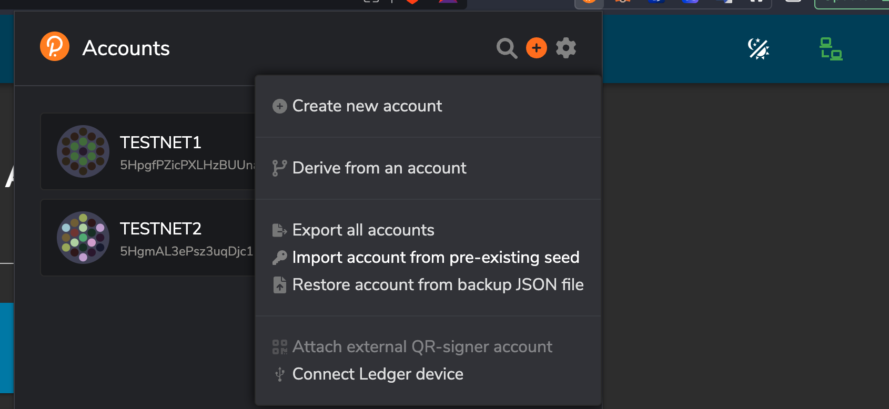
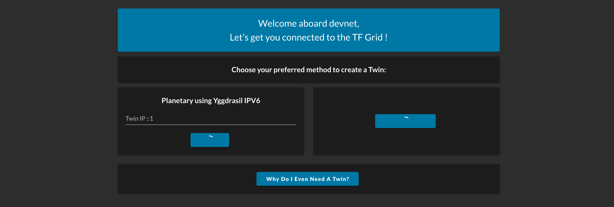
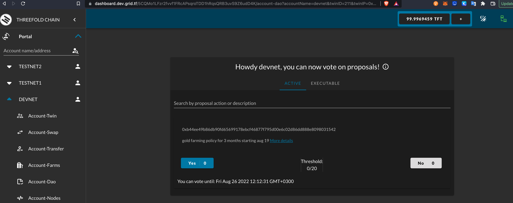

# Farming Policies

To link a farm to a *new* policy, two DAO proposals should be created:

1: To create the farming policy (can be reused by multiple farms)
2: To attach the farm to a certain policy ID with some optional restrictions


For every proposal, ideally a forum post should be created with the details of what/why.

### Create policy

Look at the parameters in the code from creating a policy, adjust them and afterwards create the policy and also env_dev.sh and env_prod.sh.

```bash
#to test
bash run_dev.sh
#to run for production
bash run_prod.sh
```

Once this proposal is created, it can be voted on by all the farms in the system.

### Attach a farm to a policy

Look at the parameters in the code for attaching a farm to a policy, adjust them and afterwards link the farm to the policy.

```
...
```

Once this proposal is created, it can be voted on by all the farms in the system.

### Test on Devnet


see https://dashboard.dev.grid.tf/ 

make sure polkadot widget is installed, when opening this link an popup will ask you to login

  

- Import following key to enable access to devnet (this is just for test purposes)

> ```detect cancel syrup indoor day such eternal valid lawn apart cat certain```

- you will have to accept terms & conditions (see botomn of screen)

  

- Click on automatic and let the dashboard activate your account.


One enabled you can always go directly to the dashboard with this link 

- https://dashboard.dev.grid.tf/5CQMo1LFzr2fvvf1FRcAPsqroTDD1hRqsQRB3uvS9Z6udD4K?accountName=devnet

You should now see something like

  

Before you can continue you need to have a farm with active nodes.


